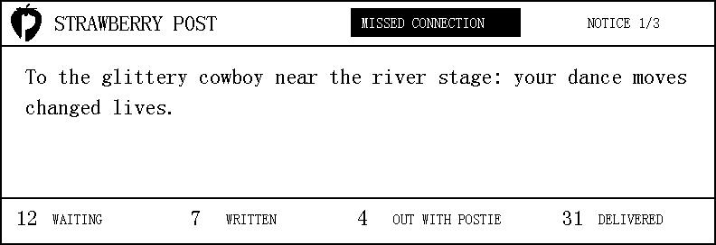

# E-paper notice board design

Stage 11 display design was approved on 7 September 2026. This document fixes
the intended behaviour and layout before the hardware driver is integrated.

## Purpose

The CrowPanel is a read-only public notice display. It does not provide an
alternative submission or Postie interface. Attendees continue to use the
local website from their phones.

## Approved layout

- Native landscape resolution: 792 by 272 pixels.
- Black and white output only.
- Header from `y=0` through `y=49`: one-bit Strawberry Post logo,
  `STRAWBERRY POST` in the 24-pixel font, compact inverted category label,
  and current notice position.
- Notice body from `y=52` through `y=218`: nearly the full screen width,
  word-wrapped 24-pixel driver font, and approximately 61 fixed-width
  characters per line with the approved margins.
- Postal summary from `y=220` through `y=271`: aggregate counts for Waiting,
  Written, Out with Postie, and Delivered, using 24-pixel numbers and
  16-pixel labels.

The footer contains aggregate counts, not individual tracking numbers.
`CouldNotFind` letters remain visible through public tracking but do not need a
separate footer count.

## Rotation behaviour

- Show one active public notice at a time.
- Advance to the next notice every 30 seconds.
- Preserve stable ordering while the notice set remains unchanged.
- Pick up new notices and postal count changes at the next scheduled refresh.
- With one notice, refresh only when content or counts change.
- With no active notices, show the approved empty-board message.
- Do not refresh the physical panel when the next framebuffer is identical.

## Font and input handling

Elecrow's supplied driver provides fixed-width printable ASCII bitmap tables at
12, 16, 24, and 48 pixels. The approved layout uses the 16 and 24-pixel tables.

The website accepts valid UTF-8, including emoji, but the stock display font
does not. Display rendering must convert punctuation to safe ASCII and replace
unsupported characters without changing the stored or web-visible message.
Text fitting and sanitisation must be independently testable without hardware.

## Refresh policy

Initial implementation targets:

- one full clean refresh at boot;
- fast refresh when a changed frame is due;
- one full clean refresh after every 10 fast refreshes to limit ghosting;
- panel deep sleep after each update;
- configurable 30-second rotation and full-clean interval.

These are starting points, not claimed hardware measurements. Ghosting,
refresh duration, Wi-Fi responsiveness, and power behaviour must be measured on
the CrowPanel before festival use.

## Integration constraints

- Read from the in-memory models instead of making HTTP requests to the device.
- Keep all display-driver calls in one execution context.
- Copy a bounded display snapshot before rendering.
- Continue servicing Wi-Fi, DNS, and HTTP while practical during refresh.
- A display initialisation failure must not stop the website or storage.
- Use the pin and power assignments documented in `HARDWARE.md`.

## Hardware verification still required

- Confirm orientation and addressing across both SSD1683 halves.
- Confirm BUSY and display-power polarity.
- Measure fast and full refresh time.
- Tune the full-clean interval for ghosting.
- Check that refreshes do not cause captive-portal request failures.
- Check sunlight and viewing-distance legibility.
- Test wrapping limits and unsupported UTF-8 input.

Official reference:
[Elecrow CrowPanel 5.79-inch repository](https://github.com/Elecrow-RD/CrowPanel-ESP32-5.79-E-paper-HMI-Display-with-272-792).
